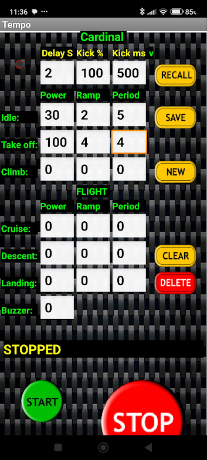

# 📱 Tempo-Timer

Android app allowing the user to define a 7 phase motor power profile for a free flight model aircraft.
---

## 📥 Download
Click the button below to download the latest version of the app.

> **Note for Android Users:** Since this app is distributed via GitHub, you may see a "Play Protect" warning. Tap **More Details** → **Install Anyway** to proceed.

---

## ✨ Features
* **Feature 1:** Allows the user to define a 7 phase motor power profile for free flight model aircraft.
* **Feature 2:** Built with MIT App Inventor.

---

## 📸 Screenshots and in use:

|  |  |  |

---

## 🛠 How to Install
1. Download the `.apk` file from the button above.
2. Open the file on your Android device.
3. If prompted, allow your browser or file manager to "Install apps from unknown sources."
4. Follow the on-screen instructions.

---

## 📄 License
This project is shared for personal use/open source.
